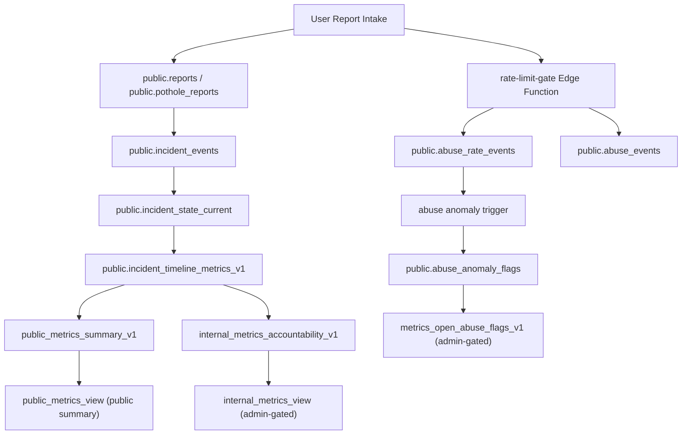

# CityReport Week 3 Submission Draft

## 1) Confirmation: 403 noise eliminated
- `tenant_visibility_config` fetch is now disabled by default in the client unless explicitly enabled by env flag:
  - `VITE_ENABLE_TENANT_VISIBILITY_CONFIG=true`
- This removes repeated non-actionable 403 noise path from standard app sessions.
- Runtime check after patch: browser console reports no active errors.

## 2) Stale/deleted reconciliation logic
Open Reports now excludes incidents that should not be listed as active:
1. Streetlight incidents with missing/deleted official assets are filtered out.
2. Incidents in closed lifecycle states are filtered out (`fixed`, `archived`, `closed`, `resolved`, `completed`, `done`, `operational`).
3. Streetlights additionally use computed incident status (`isFixed`) to block operational items from Open Reports.

## 3) Metric formula documentation summary
Canonical reference:
- `/Users/oquendoproductions/Documents/New project/docs/governance/metrics-calculation-spec.md`

Week 3 locked definitions include:
1. UTC storage + UTC calculation windows.
2. Half-open date ranges (`from` inclusive, `to` exclusive next-day boundary).
3. Time-to-close = `fixed_at - first_reported_at` (seconds).
4. Reopen rate = incidents with `reopen_count > 0` / incidents fixed in window.
5. Chronic threshold frozen to `reopen_count >= 2` in trailing 90 days.

## 4) Abuse telemetry schema summary
Migration applied:
- `/Users/oquendoproductions/Desktop/streetlight-app/streetlight-web/supabase/migrations/20260303033500_week3_hardening_abuse_and_metrics_views.sql`

New table:
- `public.abuse_events`

Core columns:
1. `domain`
2. `identity_hash`
3. `ip_hash`
4. `event_kind`
5. `allowed`
6. `event_count`
7. `unit_count`
8. `reason`
9. `metadata`
10. `created_at`

Notes:
- RLS enabled + forced.
- Admin-only read/update policy.
- Edge function `rate-limit-gate` updated to log allow/deny telemetry.

## 5) Public/internal data-path diagram

## 6) Export schema v1 freeze confirmation
CSV exports include required metadata header lines:
1. `# export_schema_version: v1`
2. `# generated_at_utc: ...`
3. `# window_start_utc: ...`
4. `# window_end_utc: ...`
5. `# domain: ...`

Validated in function test with generated export files.

## Deployment note
The `rate-limit-gate` source was updated locally, but edge function deployment requires Supabase access token in this environment.
